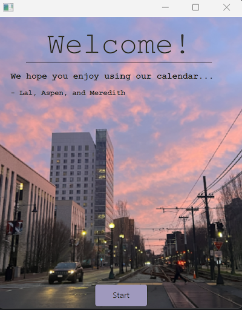
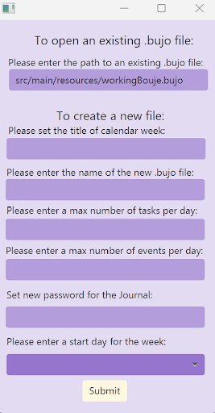
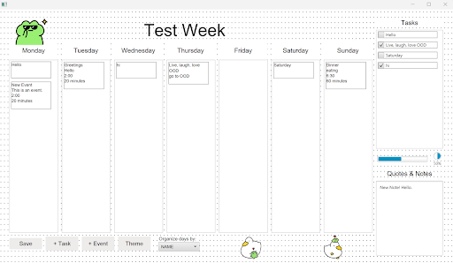
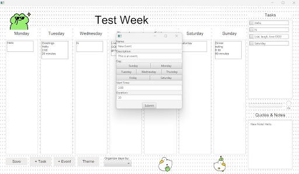

# 3500 PA05 Project Repo

[PA Write Up](https://markefontenot.notion.site/PA-05-8263d28a81a7473d8372c6579abd6481)

# Pitch
Welcome to our Calendar! In this calendar, you have many options to choose from! To begin, the program
welcomes you to the program. The following new popup will ask you to choose a template, make a new
calendar, or bring up an existing calendar. Creating a template will bring up the calendar template
containing no tasks or events. You can load up an existing file by submitting the path to the file.
Creating a new file will ask you to set the name of the file, set the name of the week, set the maximum
number of tasks per day, set the maximum number of events per day, and the day that you want to start
the week on. While in a calendar, you can save, add a task to a specific day, add an event to a specific
day, order the tasks and events by name or duration, and change the theme! The taskbar on the right
will list all the current tasks that you have made. Click the checkbox next to the task to see how much
progress you have made on the progress bar. In the bottom right of the calendar add your notes and
quotes! Overall, we hope you enjoy this calendar! 

# Screenshots
[]
[]
[]
[]

# SOLID Principles
## Single Responsibility Principle
In the model folder, we have two comparator classes. The " CompareByDuration " class completes
one responsible for comparing events by their duration lengths. The class called “CompareByInputName”
completes one responsible for comparing events by their name in alphabetical order.
## Open-Closed Principle
In our “controller” interface, we are presenting the open-closed principle. Here the interface is an
entrance for an extension to all classes that implement it. Additionally, the “controller” interface
is closed for modification on existing implementing subclasses.
## Liskov Substitution Principle
In our abstract class called “UserCalInput” we contain all the information for two subclasses, “Task”
and “EventIn”. In this case, objects in the “UserCalInput” class can be replaced in both the “Task”
class and “EventIn”. This shows that the abstraction is effective and working on our code.
## Interface Segregation Principle
We felt that our design did not need to include interface segregation because of how our model,
controller, and view are designed. For each of these aspects, we have one interface that contains
what we feel was necessary for the best organization.
## Dependency Inversion Principle
Our “UserCalInput” is an example of how a high-level module should not depend on a low-level module.
Both classes, “EventIn” and “Task” depend on the abstraction class and not each other.

# Extensions
We could have extended our calendar to have a vertical layout. To do this, the user could be prompted
to select vertical or horizontal in the beginning popup. We would have to make an additional GUI in
scene builder that reorganized our information in a vertical format.

# Attribution
- https://depositphotos.com/13137093/stock-illustration-laughing-rock-cartoon.html
- https://wallpaperaccess.com/pastel-pink-heart
- https://www.istockphoto.com/illustrations/notes-abstract-gold-music-background
- https://www.instagram.com/frogeposting/#
- https://www.freepik.com/premium-vector/dotted-grid-seamless-pattern-bullet-journal-black-point-texture-black-dot-grid-notebook-paper-vector-illustration-white-background_24711017.htm
- https://www.vecteezy.com/free-vector/coding-background